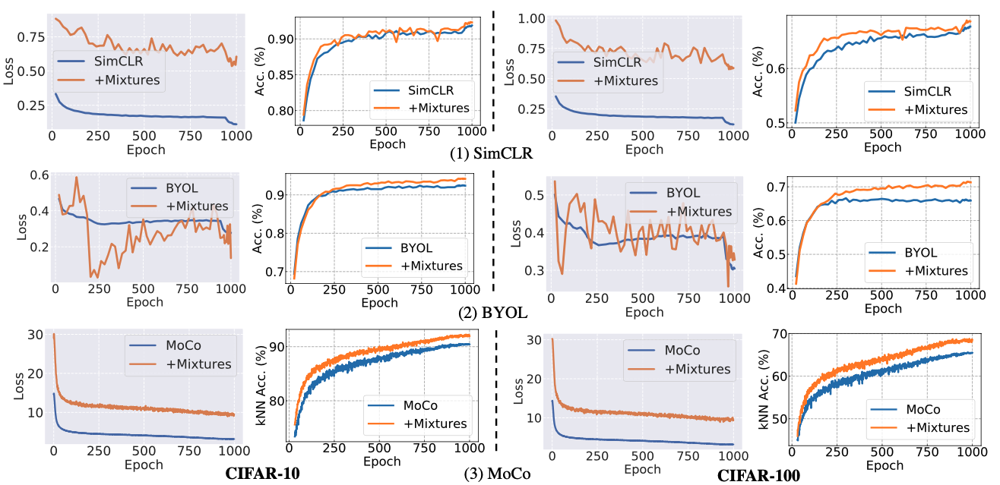
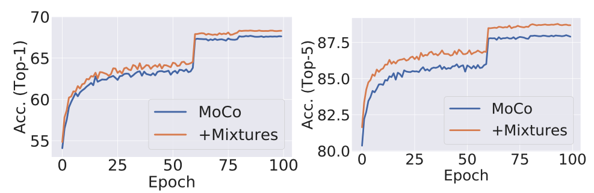
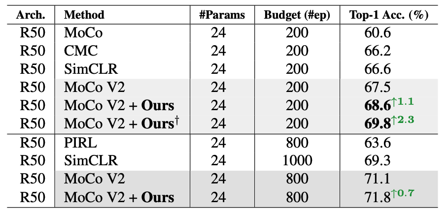
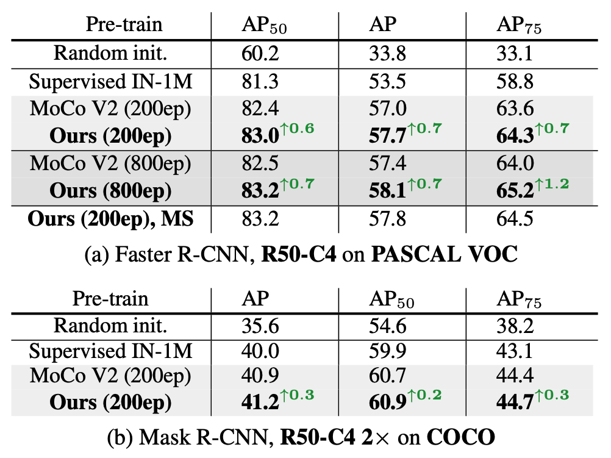
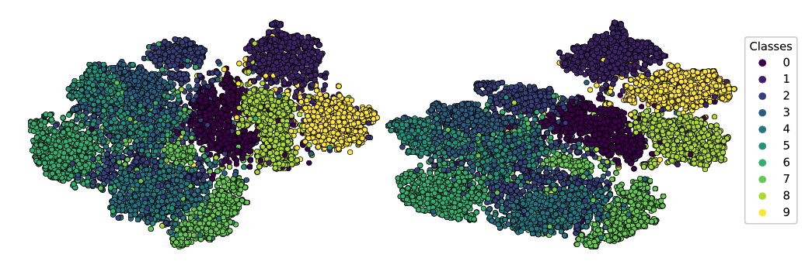
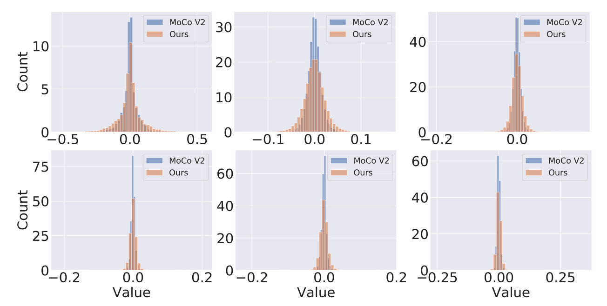

## Un-Mix: Rethinking Image Mixtures for Unsupervised Visual Representation Learning


## Update (02/15/2021)

We update our [manuscript](https://arxiv.org/pdf/2003.05438.pdf) with a more comprehensive study using *image mixtures* method on unsupervised learning. The core codes of our method can be summarized as follows:

```python:
# P: probability of global or local level mixtures 
# beta: hyperparameter for Beta distribution
# lam: mixture ratio in global-level mixture or bounding box location in region-level mixture
args.beta = 1.0
for x in loader: # load a minibatch x with N samples
    # Probability of choosing global or local level mixtures
    prob = np.random.rand(1)
    lam = np.random.beta(args.beta, args.beta) 
    images_reverse = torch.flip(x[0], (0,))
    if prob < args.P:
	# global-level mixtures
	mixed_images = lam*x[0]+(1-lam)* images_reverse
	mixed_images_flip = torch.flip(mixed_images, (0,))
    else:
	# region-level mixtures
	mixed_images = x[0].clone()
	bbx1, bby1, bbx2, bby2 = utils.rand_bbox(x[0].size(), lam)
	mixed_images[:, :, bbx1:bbx2, bby1:bby2] = images_reverse[:, :, bbx1:bbx2, bby1:bby2] 
	mixed_images_flip = torch.flip(mixed_images,(0,))
	lam = 1 - ((bbx2 - bbx1) * (bby2 - bby1) / (x[0].size()[-1] * x[0].size()[-2]))
    # original loss term
    loss_ori = model(x)
    # In following two losses, we found using ''x[0]'' may perform better on some particular datasets
    # loss for the normal order of mixtures
    loss_m1 = model([x[1], mixed_images])
    # loss for the reverse order of mixtures
    loss_m2 = model([x[1], mixed_images_flip])
    # final loss function (our core code)
    loss = loss_ori + lam * loss_m1 + (1-lam) * loss_m2
    # update gradients
    optimizer.zero_grad() 
    loss.backward() 
    optimizer.step()
    ...
```

This repo contains the implementation for [Un-Mix: Rethinking Image Mixture for Unsupervised Visual Representation Learning](https://arxiv.org/pdf/2003.05438.pdf), which perturbs input image  space to soften the output prediction space indirectly, meanwhile, assigning new label values in the unsupervised frameworks accordingly. So that the proposed method can smooth decision boundaries and prevent the learner from becoming over-confident.

## Our Motivation: Soften Input/label Spaces

<div align=center>

</div>

<div align=left>
Figure 1:  Illustration of our motivation on contrastive-based unsupervised learning approaches. Contrastive learning measures the similarity of sample pairs in the latent representation space. With flattened prediction, the model is encouraged to treat each incorrect instance as equally probable, which will  smooth decision boundaries and prevent the learner from becoming over-confident.
</div> 


## Results

We run our method with [SimCLR](https://arxiv.org/abs/2002.05709?ref=hackernoon.com), [BYOL](https://arxiv.org/abs/2006.07733), [MoCo](https://arxiv.org/abs/1911.05722) and [MoCo V2](https://arxiv.org/abs/2003.04297), the results are as follows:

<div align=center>

</div>

<div align= center>
Figure 2: The curves of training loss and testing accuracy of SimCLR, BYOL and MoCo on CIFAR-10/100 datasets.
</div> 

<div align=center>

</div>

<div align= center>
Figure 3: Linear classification accuracy of Top-1 (left) and Top-5 (right) with MoCo V2 and ours on ImageNet dataset.
</div> 

<div align=center>

</div>

<div align=center>
Table 1: Comparison of linear classification on standard ImageNet. † denotes our result using multi-scale training.
</div> 

<div align=center>

</div>

<div align=center>
Table 2: Object detection results fine-tuned on PASCAL VOC (a) and COCO (b).
</div> 

<!--## An Example of Using this Code on MoCo-->

## Visualizations

<div align=center>

</div>

<div align=center>
Figure 4: Visualization of feature embedding with MoCo on CIFAR-10.
</div> 

<div align=center>

</div>

<div align=center>
Figure 5: Illustration of weight distributions at 1, 10, 20, 30, 40 and 50-th convolutional layers in a ResNet-50 on ImageNet.
</div> 

## Citation

If you find this repo useful for your research, please consider citing the paper

```
@article{shen2020rethinking,
  title={Un-Mix: Rethinking Image Mixture for Unsupervised Visual Representation Learning},
  author={Shen, Zhiqiang and Liu, Zechun and Liu, Zhuang and Savvides, Marios and Darrell, Trevor and Xing, Eric},
  journal={arXiv preprint arXiv:2003.05438},
  year={2020}
}
```

**For any questions, please contact Zhiqiang Shen (zhiqiangshen0214 at gmail.com).**

## Acknowledgements

MoCo V1&V2 (https://github.com/facebookresearch/moco)

Whitening (https://github.com/htdt/self-supervised)

PyTorch Image Classification (https://github.com/hysts/pytorch_image_classification)
