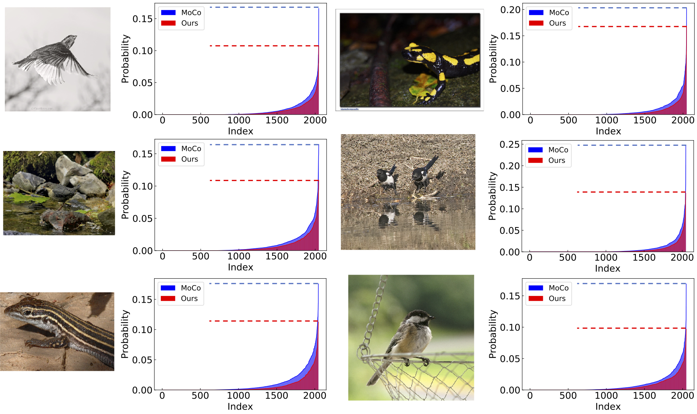

## Rethinking Image Mixture for Unsupervised Visual Representation Learning

This repo contains the implementation for [Rethinking Image Mixture for Unsupervised Visual Representation Learning](http://arxiv.org/abs/2003.05438), which perturbs input image  space to soften the output prediction space indirectly, so that the proposed method can smooth decision boundaries and prevent the learner from becoming over-confident.

## Our Motivation: Soften Predictions

<div align=center>

</div>

<div align=left>
Figure 1:  Illustration of our motivation on contrastive-based unsupervised learning approaches. Contrastive learning measures the similarity of sample pairs in the latent representation space. With flattened prediction, the model is encouraged to treat each incorrect instance as equally probable, which will  smooth decision boundaries and prevent the learner from becoming over-confident.
</div> 

## An Example of Using this Code on MoCo and CMC

CMC with Image Mixture (https://github.com/szq0214/CMC_with_Image_Mixture).

IM flag:
- `--IM`: train with IM space.
- `--IM_type`: specify the type of IM and other augmentation methods that we implement, including: 'IM', 'global', 'region', 'Cutout', 'RandomErasing'.

Global mixture:
- `--g_alpha`: global mix alpha. Default: 1.0
- `--g_num`: global mix num. Default: 2
- `--g_prob`: global mix prob. Default: 0.1

Region-level mixture:
- `--r_beta`: region mix beta. Default: 1.0
- `--r_prob`: region mix prob. Default: 0.1
- `--r_num`: region mix num. Default: 2
- `--r_pixel_decay`: region mix pixel decay. Default: 1.0

We also include other data augmentation methods like Cutout and Random Erasing in this repo, the results are inferior than ours.

## Results

We run our method with [MoCo](https://arxiv.org/abs/1911.05722) and [CMC](https://arxiv.org/abs/1906.05849), the results are as follows:

<div align=center>

</div>

<div align=left>
Figure 2: Linear classification accuracy with different pre-training budget on ImageNet-100. The dotted lines denotethe baseline results and the solid linesare with our method. The red color denotes MoCo method and blue color is CMC.
</div> 

## Visualizations

<div align=center>

</div>

<div align=left>
Figure 3:  2048-dim of predictions from unsupervised pre-trained ResNet-50 on ImageNet-1K val set. Our model obtains more flattened distribution than MoCo when feeding into the same image with the contrastively pre-trained models.
</div> 

## Citation

If you find this repo useful for your research, please consider citing the paper

```
@article{shen2020rethinking,
  title={Rethinking Image Mixture for Unsupervised Visual Representation Learning},
  author={Shen, Zhiqiang and Liu, Zechun and Liu, Zhuang and Savvides, Marios and Darrell, Trevor},
  journal={arXiv preprint arXiv:2003.05438},
  year={2020}
}
```
For any questions, please contact Zhiqiang Shen (zhiqians@andrew.cmu.edu).

## Acknowledgements

Contrastive Multiview Coding (https://github.com/HobbitLong/CMC)

PyTorch Image Classification (https://github.com/hysts/pytorch_image_classification)
