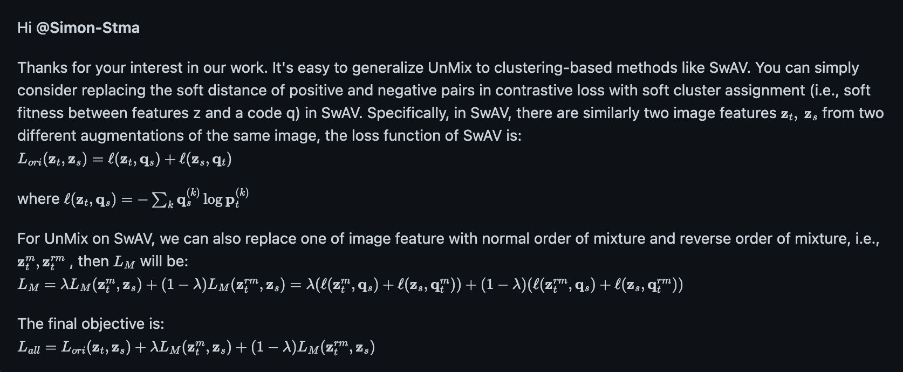
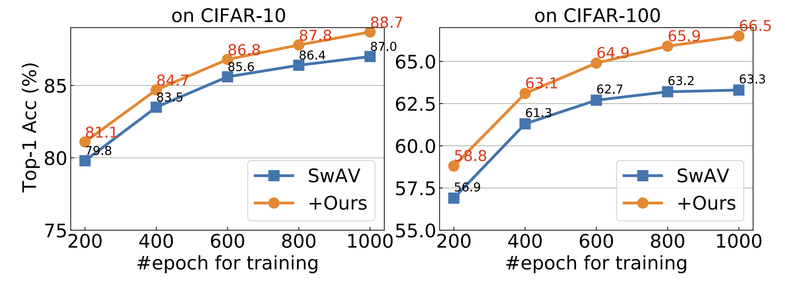
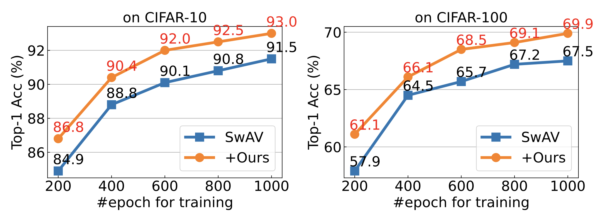

# Un-Mix with SwAV on CIFAR-10/100 Datasets
This code provides a PyTorch implementation of **[Un-Mix](https://arxiv.org/abs/2003.05438)** on SwAV ([Unsupervised Learning of Visual Features by Contrasting Cluster Assignments](https://arxiv.org/abs/2006.09882)) for **CIFAR-10 and 100 datasets**. It is modified from [SwAV code on ImageNet](https://github.com/facebookresearch/swav). 

The released code can obtain **2~4% higher** results on CIFAR than we reported in the paper as we fixed a small data preprocessing bug (replacing ImageNet's mean and std with CIFAR's), and also use ``smaller batch-size (256-->128)`` since CIFAR datasets prefer. The new results are provided below.

The mathematical explanation of Un-Mix with clustering-based methods can be found [here](https://github.com/szq0214/Un-Mix/issues/7#issuecomment-1157572883):

<div align=center>

</div>


# Our Results

## Results reported in the paper：

<div align=center>

</div>

## Results from this repo:

<div align=center>

</div>


**Results on CIFAR-10:**
	
| Model    | epochs  | acc.  | weights (last) |logs| args|
|:-------:|:--------:|:--------:|:--------:|:--------:|:--------:|
| SwAV | 200 | 84.9% | [link](https://drive.google.com/drive/folders/1EHCU100944difnz8eqWpNME-NAHBvkce?usp=sharing) |  [link](https://drive.google.com/drive/folders/1P4X2aiQ2Wv-YMd_xR62UdfBsp299_9eX?usp=sharing) |  [link](./script_unmix_c10.sh) |
| **Un-Mix** | 200 | **86.8%**  | [link](https://drive.google.com/drive/folders/1EHCU100944difnz8eqWpNME-NAHBvkce?usp=sharing) |  [link](https://drive.google.com/drive/folders/1P4X2aiQ2Wv-YMd_xR62UdfBsp299_9eX?usp=sharing) |  [link](./script_unmix_c10.sh) | 
|   |   |  |  |  |
| SwAV | 400 | 88.8% | [link](https://drive.google.com/drive/folders/1EHCU100944difnz8eqWpNME-NAHBvkce?usp=sharing) |  [link](https://drive.google.com/drive/folders/1P4X2aiQ2Wv-YMd_xR62UdfBsp299_9eX?usp=sharing) |  [link](./script_unmix_c10.sh) |
| **Un-Mix** | 400 | **90.4%**  | [link](https://drive.google.com/drive/folders/1EHCU100944difnz8eqWpNME-NAHBvkce?usp=sharing) |  [link](https://drive.google.com/drive/folders/1P4X2aiQ2Wv-YMd_xR62UdfBsp299_9eX?usp=sharing) |  [link](./script_unmix_c10.sh) | 
|   |   |  |  |  |
| SwAV | 600 | 90.1% | [link](https://drive.google.com/drive/folders/1EHCU100944difnz8eqWpNME-NAHBvkce?usp=sharing) |  [link](https://drive.google.com/drive/folders/1P4X2aiQ2Wv-YMd_xR62UdfBsp299_9eX?usp=sharing) |  [link](./script_unmix_c10.sh) |
| **Un-Mix** |600 | **92.0%**  | [link](https://drive.google.com/drive/folders/1EHCU100944difnz8eqWpNME-NAHBvkce?usp=sharing) |  [link](https://drive.google.com/drive/folders/1P4X2aiQ2Wv-YMd_xR62UdfBsp299_9eX?usp=sharing) |  [link](./script_unmix_c10.sh) | 
|   |   |  |  |  |
| SwAV | 800 | 90.8% | [link](https://drive.google.com/drive/folders/1EHCU100944difnz8eqWpNME-NAHBvkce?usp=sharing) |  [link](https://drive.google.com/drive/folders/1P4X2aiQ2Wv-YMd_xR62UdfBsp299_9eX?usp=sharing) |  [link](./script_unmix_c10.sh) |
| **Un-Mix** | 800 | **92.5%**  | [link](https://drive.google.com/drive/folders/1EHCU100944difnz8eqWpNME-NAHBvkce?usp=sharing) |  [link](https://drive.google.com/drive/folders/1P4X2aiQ2Wv-YMd_xR62UdfBsp299_9eX?usp=sharing) |  [link](./script_unmix_c10.sh) | 
|   |   |  |  |  |
| SwAV | 1000 | 91.5% | [link](https://drive.google.com/drive/folders/1EHCU100944difnz8eqWpNME-NAHBvkce?usp=sharing) |  [link](https://drive.google.com/drive/folders/1P4X2aiQ2Wv-YMd_xR62UdfBsp299_9eX?usp=sharing) |  [link](./script_unmix_c10.sh) |
| **Un-Mix** | 1000 | **93.0%**  | [link](https://drive.google.com/drive/folders/1EHCU100944difnz8eqWpNME-NAHBvkce?usp=sharing) |  [link](https://drive.google.com/drive/folders/1P4X2aiQ2Wv-YMd_xR62UdfBsp299_9eX?usp=sharing) |  [link](./script_unmix_c10.sh) | 


**Results on CIFAR-100:**
	
| Model    | epochs  | acc. (Top-1)  | weights (last) |logs| args|
|:-------:|:--------:|:--------:|:--------:|:--------:|:--------:|
| SwAV | 200 | 57.9% | [link](https://drive.google.com/drive/folders/1pSJKWkgwdeLrigQmEzt_s2Jg__UrQE5d?usp=sharing) |  [link](https://drive.google.com/drive/folders/1BPQcrmEq9d-5MQ1AXpv0h0ZOBvh3QPxp?usp=sharing) | [link](./script_unmix_c100.sh) | 
| **Un-Mix** | 200 | **61.1%**  | [link](https://drive.google.com/drive/folders/1pSJKWkgwdeLrigQmEzt_s2Jg__UrQE5d?usp=sharing) |  [link](https://drive.google.com/drive/folders/1BPQcrmEq9d-5MQ1AXpv0h0ZOBvh3QPxp?usp=sharing) |  [link](./script_unmix_c100.sh) | 
|   |   |  |  |  |
| SwAV | 400 | 64.5% | [link](https://drive.google.com/drive/folders/1pSJKWkgwdeLrigQmEzt_s2Jg__UrQE5d?usp=sharing) |  [link](https://drive.google.com/drive/folders/1BPQcrmEq9d-5MQ1AXpv0h0ZOBvh3QPxp?usp=sharing) | [link](./script_unmix_c100.sh) | 
| **Un-Mix** | 400 | **66.1%**  | [link](https://drive.google.com/drive/folders/1pSJKWkgwdeLrigQmEzt_s2Jg__UrQE5d?usp=sharing) |  [link](https://drive.google.com/drive/folders/1BPQcrmEq9d-5MQ1AXpv0h0ZOBvh3QPxp?usp=sharing) |  [link](./script_unmix_c100.sh) | 
|   |   |  |  |  |
| SwAV | 600 | 65.7% | [link](https://drive.google.com/drive/folders/1pSJKWkgwdeLrigQmEzt_s2Jg__UrQE5d?usp=sharing) |  [link](https://drive.google.com/drive/folders/1BPQcrmEq9d-5MQ1AXpv0h0ZOBvh3QPxp?usp=sharing) | [link](./script_unmix_c100.sh) | 
| **Un-Mix** |600 | **68.5%**  | [link](https://drive.google.com/drive/folders/1pSJKWkgwdeLrigQmEzt_s2Jg__UrQE5d?usp=sharing) |  [link](https://drive.google.com/drive/folders/1BPQcrmEq9d-5MQ1AXpv0h0ZOBvh3QPxp?usp=sharing) |  [link](./script_unmix_c100.sh) | 
|   |   |  |  |  |
| SwAV | 800 | 67.2% | [link](https://drive.google.com/drive/folders/1pSJKWkgwdeLrigQmEzt_s2Jg__UrQE5d?usp=sharing) |  [link](https://drive.google.com/drive/folders/1BPQcrmEq9d-5MQ1AXpv0h0ZOBvh3QPxp?usp=sharing) | [link](./script_unmix_c100.sh) | 
| **Un-Mix** | 800 | **69.1%**  | [link](https://drive.google.com/drive/folders/1pSJKWkgwdeLrigQmEzt_s2Jg__UrQE5d?usp=sharing) |  [link](https://drive.google.com/drive/folders/1BPQcrmEq9d-5MQ1AXpv0h0ZOBvh3QPxp?usp=sharing) |  [link](./script_unmix_c100.sh) | 
|   |   |  |  |  |
| SwAV | 1000 | 67.5% | [link](https://drive.google.com/drive/folders/1pSJKWkgwdeLrigQmEzt_s2Jg__UrQE5d?usp=sharing) |  [link](https://drive.google.com/drive/folders/1BPQcrmEq9d-5MQ1AXpv0h0ZOBvh3QPxp?usp=sharing) | [link](./script_unmix_c100.sh) | 
| **Un-Mix** | 1000 | **69.9%**  | [link](https://drive.google.com/drive/folders/1pSJKWkgwdeLrigQmEzt_s2Jg__UrQE5d?usp=sharing) |  [link](https://drive.google.com/drive/folders/1BPQcrmEq9d-5MQ1AXpv0h0ZOBvh3QPxp?usp=sharing) |  [link](./script_unmix_c100.sh) | 

The results using ``bs=256`` are available at [CIFAR-10](https://drive.google.com/drive/folders/1VUDMlp0NcawRPyPZSIEinSXULufdSmjO?usp=sharing) and [CIFAR-100](https://drive.google.com/drive/folders/1ivyarxLdOajpjrLn06CcROdPIz-H74FC?usp=sharing).

# Training Un-Mix with SwAV

## Requirements
- Python 3.6
- [PyTorch](http://pytorch.org) install = 1.4.0
- torchvision
- CUDA 10.1
- [Apex](https://github.com/NVIDIA/apex) with CUDA extension (see [how I installed apex](https://github.com/facebookresearch/swav/issues/18#issuecomment-748123838))
- Other dependencies: opencv-python, scipy, pandas, numpy

## Multinode training and evaluation
Distributed training is available via Slurm. We provide several ``SBATCH scripts`` to reproduce our results (1%~1.5% higher than we reported in the paper).
For example, to train and evaluate Un-Mix on CIFAR-10 using 1 node and 1 GPU with a batch size of 128 for 400 epochs, run:

```
sbatch ./script_unmix_c10.sh
```

Note that the **evaluation script** is also inside the above script.


## Singlenode training

You can simply replace ``srun --label python -u main_swav_unmix.py`` with ``python -m torch.distributed.launch --nproc_per_node=1 main_swav_unmix.py`` in ``script_unmix_c10.sh``.

For example, to train Un-Mix for 400 epochs, run:

```
python -m torch.distributed.launch --nproc_per_node=1 main_swav_unmix.py \
--dist_url 'tcp://localhost:10001' \
--data_path $DATASET_PATH \
--arch ${ARCH} \
--epochs $nepochs \
--base_lr $LR_start \
--final_lr $LR_end \
--warmup_epochs $warmup_epochs \
--batch_size $bs \
--size_crops $size_crops \
--nmb_crops $nmb_crops \
--min_scale_crops $min_scale_crops \
--max_scale_crops $max_scale_crops \
--use_fp16 $use_fp16 \
--run_swav $run_swav \
--freeze_prototypes_niters $freeze_prototypes_niters \
--nmb_prototypes $nmb_prototypes \
--queue_length $queue_length \
--hidden_mlp $hidden_mlp \
--epoch_queue_starts $epoch_queue_starts \
--dump_path $EXPERIMENT_PATH \
--temperature 0.1 \
--epsilon 0.05 \
--workers 2
```
The detailed training scripts can be found in ``script_unmix_c10.sh`` and ``script_unmix_c100.sh``.

# Evaluating models

## Evaluate models: Linear classification on CIFAR
To train a supervised linear classifier on CIFA-10 with frozen features/weights on a single node with 1 gpu, run:

```
python -m torch.distributed.launch --nproc_per_node=1 eval_linear.py \
--dist_url 'tcp://localhost:10001' \
--num_labels 10 \
--crop_size 32 \
--workers 2 \
--arch resnet18 \
--data_path cifar10 \
--pretrained ${EXPERIMENT_PATH}/checkpoint.pth.tar \
--dump_path ${EXPERIMENT_PATH}_linear_eval
```
The detailed linear classifier scripts can be found in ``script_unmix_c10.sh`` and ``script_unmix_c100.sh``.

# Run SwAV only on CIFAR without Un-Mix

You can simply set ``run_swav=True`` in ``script_unmix_c10.sh`` and ``script_unmix_c100.sh``.


## License
See the [LICENSE](LICENSE) file for more details.


## Citation
If you find this repository useful in your research, please cite:

```
@article{caron2020unsupervised,
  title={Unsupervised Learning of Visual Features by Contrasting Cluster Assignments},
  author={Caron, Mathilde and Misra, Ishan and Mairal, Julien and Goyal, Priya and Bojanowski, Piotr and Joulin, Armand},
  booktitle={Proceedings of Advances in Neural Information Processing Systems (NeurIPS)},
  year={2020}
}
```

```
@article{shen2020mix,
  title={Un-mix: Rethinking image mixtures for unsupervised visual representation learning},
  author={Shen, Zhiqiang and Liu, Zechun and Liu, Zhuang and Savvides, Marios and Darrell, Trevor and Xing, Eric},
  journal={arXiv preprint arXiv:2003.05438},
  year={2020}
}
```